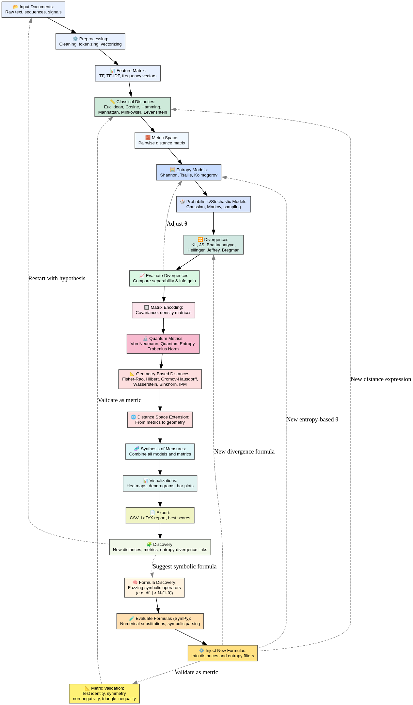

# dist-framework
Distance(s) and metric(s) calculation framework. A framework in python for discovering and testing new distances and metrics. This is an experimental program that permit to test for distance and metrics using fuzzy matching techniques. You need to configure the script to make it works if not it will fail. 

## Install
Load libraries :
```
pip3 install --upgrade scikit-learn numpy pandas matplotlib seaborn scipy POT sympy umap-learn ripser persim torch
```

Execute : 
```
chmod +x dist-framework.py
```

## Convert the results to pdf :
```
pdflatex distance_formulas.tex
```

## Usage 
Create a folder named documents, paste the data you want to find distances with, text files IE. 
Configure and execute the script.

## distance & metrics computation model

